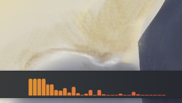
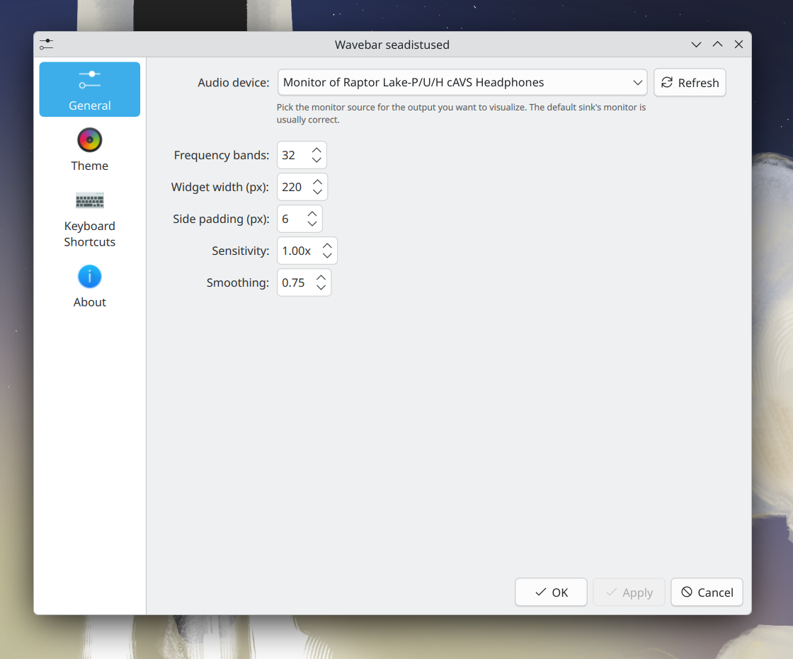
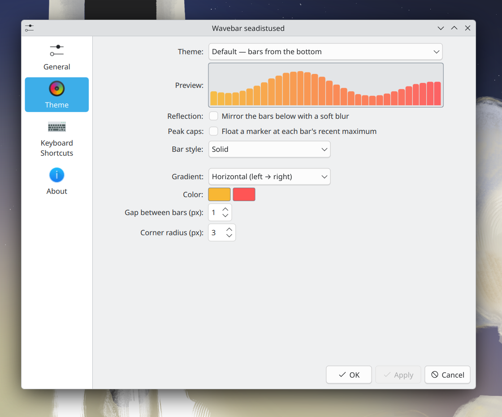

# Wavebar

A real-time audio spectrum visualizer for the KDE Plasma 6 panel.



It taps a PipeWire / PulseAudio monitor source via `parec`, runs an FFT in a small Python daemon, and serves the resulting magnitudes over a localhost HTTP endpoint that the QML widget polls at ~30 Hz.

## Themes

- **Default** — bars rising from the baseline, with optional blurred reflection
- **Centered** — bars extending symmetrically up and down from the centre
- **Line** — single oscilloscope-style curve, with optional CRT-glow trail

Each bar theme can be rendered as solid bars or vintage VU-style segmented blocks, and supports peak caps that float at each bar's recent maximum.

## Requirements

- KDE Plasma **6.0+**
- `parec` (from `pulseaudio-utils` or `pipewire-pulse`)
- `python3` with `numpy`
- `kpackagetool6`

## Install

```sh
./install.sh
```

Then restart plasmashell:

```sh
systemctl --user restart plasma-plasmashell.service
```

Right-click the panel → **Add or Manage Widgets…** → search "Wavebar".

## Configuration

Right-click the widget → **Configure…**

- **General** — pick the audio monitor source, number of frequency bands, widget width, sensitivity, smoothing
- **Theme** — theme, colours / gradient direction, bar style, peak caps, theme-specific options

The default sink's `.monitor` source is usually the right pick for visualising whatever is currently playing.





## License

MIT
